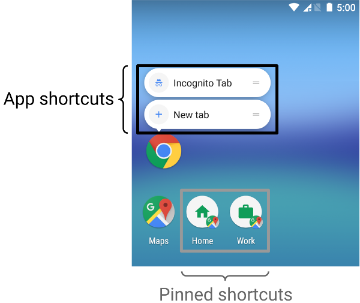
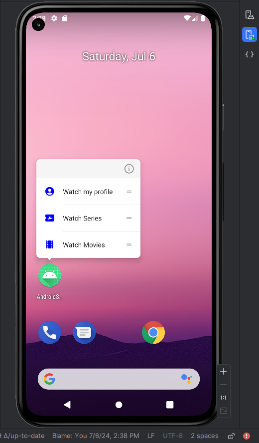
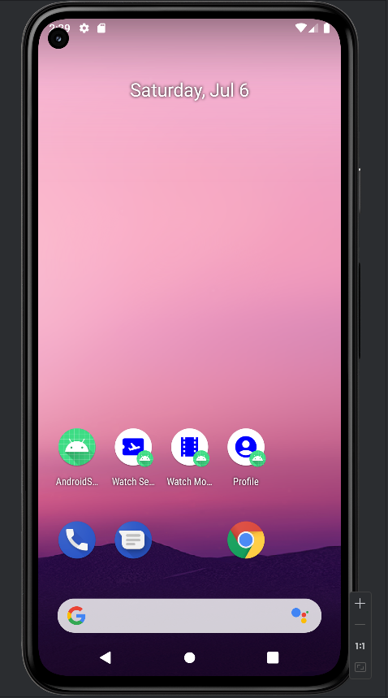

# AndroidShortcuts
This is project shortcuts implement Shortcuts Manager SDK

### Pre-requisites ###
* Android Studio Iguana | 2023.2.1
* Minimum SDK 24
* Maximum SDK 34

## Maintainers

This project is maintained by:

* [Muhamad Syafii](http://github.com/muhamadsyafii)

### Feature ###

|               | 
| ------------- | 
| * Movie |
| * Seies |
| * Profile |

## Installation

Clone this repository and import into **Android Studio**

```bash
git clone https://github.com/muhamadsyafii/AndroidShortcuts.git
```

## How I run the app?

- Clone the repository
- Open it in Android Studio
- Wait until dependencies are installed
- Run app in your emulator or physical device



## Screenshot apps

<!--  -->
<!--  -->

<div style="display: flex; flex-direction: row;">
  
  
</div>
